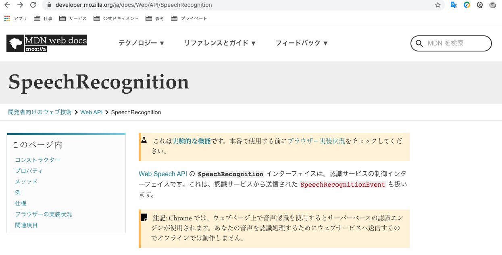

# え、５分で音声認識!?
# 😲

---
音声認識って、難しい音声解析とか  
複雑な処理が必要なんじゃないの?😟
<br>
<br>

#### **→Webの技術(javascript)だけで簡単に出来ます！**

---

# じゃあ、見せてみろ！

---
[drop=10]
**音声認識部分はこれだけ！**

```javascript,drag=80 100,drop=10 20,fit=0.8
  // SpeechRecognitionの初期化
  const recognition = new SpeechRecognition();

　// ボタン押したら音声認識開始する
  document.getElementById("button").onclick = function () {
    recognition.start();
  };

  // 認識した言葉をテキストエリアに反映する
  recognition.onresult = function (event) {
    document.getElementById("textarea").textContent =
      event.results[0][0].transcript;
  };
```

---

[drop=0,set=align-left]
HTMLも書いて、実際に動かしてみましょう!
<https://azkz.github.io/SpeechRecognitionTrial/sample.html>
@code[drag=100,drop=0 15,fit=0.7](sample.html)

---

どうですか？

---

### すごくないですか？

---

# **すごくないですか！？**

---

これは**Web Speech API**の**SpeechRecognition**という<u>実験段階</u>のWeb技術。  
だから、まだ全てのブラウザには対応していない。  
(Chromeは⭕️、Safariは❌)


---

[drop=0 20,set=align-left]
### **自分が思っているよりも**
### **Webの技術でできることがたくさんあるみたい**
<br>

- WebXR Device API(VRやARを実現する。)
- Indexed DB(ブラウザ内でNoSQL DBみたいなものを構築する。)
- Web RTC(ピアツーピアの接続を実現する。Web会議ツールとかに使われる。)
<br>
<br>

だから、
---

## **面白いの見つけたら教えてください！**

---

# *Enjoy Coding*

[drop=80,80]
#### END